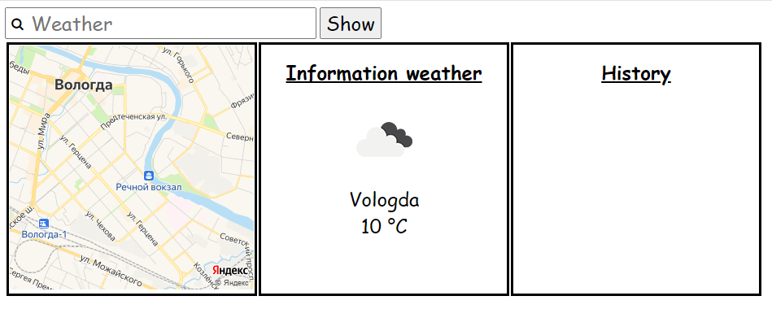
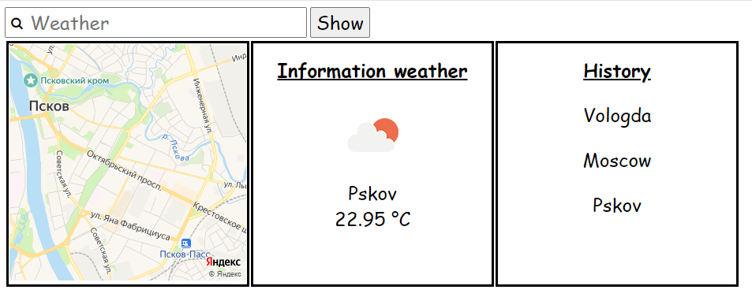
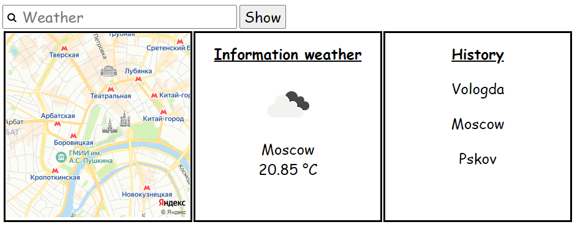

# JavaScript Developer. Basic. lesson9

Домашнее задание № 9 из курса ["OTUS JavaScript Developer. Basic"](https://github.com/vvscode/otus--javascript-basic/tree/master/lessons/lesson09)

Проект реализует приложение "Прогноз погоды"
[](https://github.com/ups2201/lesson9/actions/workflows/deploy.yml)

## Работа с репозиторием

Репозиторий обслуживается инструментами на базе Node.js. Для работы понадобится `node.js` и `npm` (в качестве пакетного менеджера).

```bash
# скачивание проекта
git clone https://github.com/ups2201/lesson9.git

#выкачивание пакетов
npm install

# сборка приложения
npm run build

# запуск приложения локально
npm run dev
```


## Структура репозитория

Репозиторий имеет следующую структуру

- в корне проекта находятся файлы настроек проекта и используемых инструментов
- в директории `src` находятся файлы проекта `index.html`, `styles.css`, `main.js`

## Просмотр проекта на GithubPages
Проект можно посмотреть на GithubPages [открыть проект](https://ups2201.github.io/lesson9/)

## Инструкция по применению

- при открытии страницы пользователь видит погоду (город, температуру и иконку) в своей местности (для получения прогноза погоды используйте Open Weather Map API)
  
- он может ввести имя города в поле ввода и увидеть погоду в выбранном городе
- введенные города сохраняются у пользователя в браузере, так что он видит последние 10 городов, где он смотрел погоду
  
- при клике по строчке города в списке он видит погоду в выбранном городе
  
- кроме информации о погоде покажите в центре страницы карту для введенного адреса (используйте Yandex Maps Static API)

При коммите должны сработать husky-хуки для проверки и форматирования измененных файлов. Дополнительная проверка настроена через github-actions.
